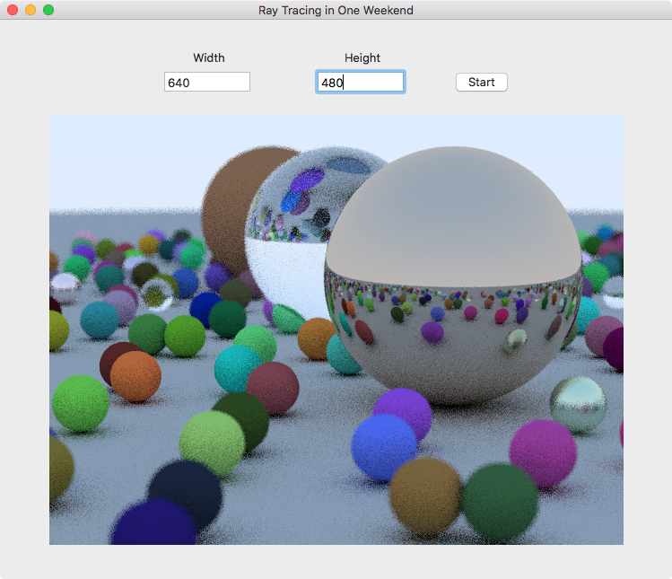

# RayTracingInOneWeekend

This is a Swift 4/Swift 5 implementation of [Ray Tracing in One Weekend by Peter Shirley](http://amzn.to/2HGCtyu). As the book's title implies, I was able to work through all 12 chapters of the book in about 10 hours, translating the code from C++ to Swift as I went. If you're trying to do the same, you may find this repository helpful. As I finished each chapter, I tagged it on Git. Therefore if you go to the Releases tab above, you can find my code as it stood at the end of every chapter. You can checkout my full review of the book [on Amazon](http://amzn.to/2IyuDrR).

Built as a Mac app on Xcode 9 and builds in Xcode 10.2 as well.

